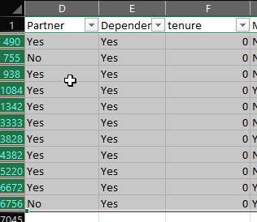
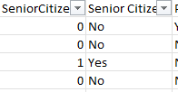
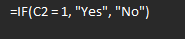
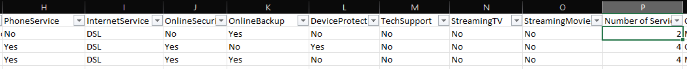

# Telco Customer Churn

## About

[Dataset pulled from Kaggle.](https://www.kaggle.com/datasets/blastchar/telco-customer-churn)
Fictional telecom company, Telco, has data about their customers. Each row represents a customer, each column contains customer’s attributes described on the column Metadata.

The data set includes information about:

* Customers who left within the last month – the column is called Churn
* Services that each customer has signed up for – phone, multiple lines, internet, online security, online backup, device protection, tech support, and streaming TV and movies
* Customer account information – how long they’ve been a customer, contract, payment method, paperless billing, monthly charges, and total charges
* Demographic info about customers – gender, age range, and if they have partners and dependents

## Goal

Develop customer retention programs by analyzing the relationship between customer characteristics and their churn rate

## Data cleaning Steps

* Finding null values in numeric columns
If a column that represents numeric values (e.g. Monthly Charges) contains null values, it needs to be investigated
Total Charges column has 11 rows that are missing values which also had a tenure value of 0. These contradictory rows were filtered for and deleted.



* Changed Senior Citizens values from (0,1) to  



(Yes, no) Using IF statement  



* Added a "Number of Services" column that counts how many services the customer is subscribed to



Using a COUNTIF() statement to count how many cells don't contain "No"

``` 
=COUNTIF(H2:O2, "<>*No*")
```